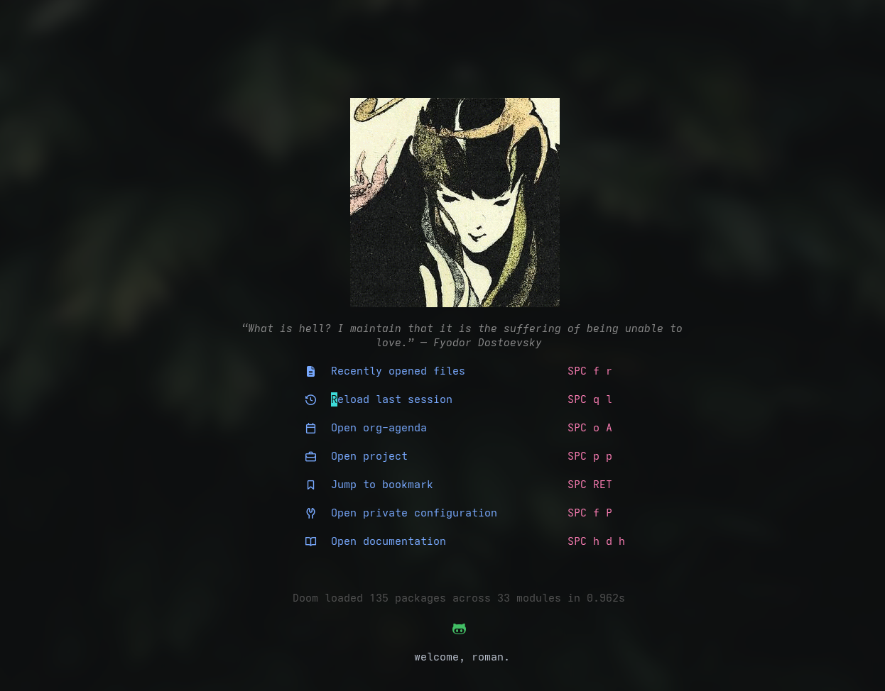
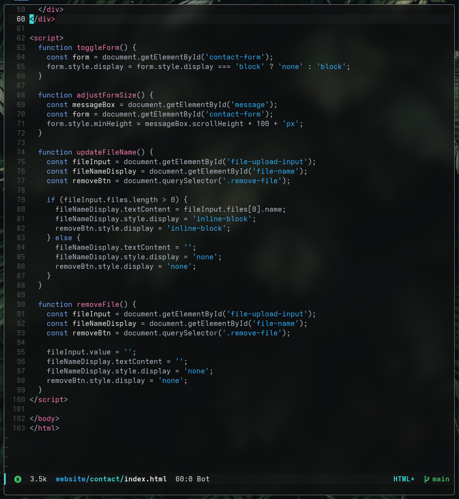

# doom-oxocarbon

A modern Emacs theme ported from the Neovim theme **oxocarbon**, inspired by IBM Carbon design language, and built to integrate  with Doom Emacs.

This theme aims to be:
- Faithful to oxocarbon's contrast and color intent
- Idiomatic to Doom's theming system
- Lightweight, readable, and actively maintained

Unlike some previous Emacs ports, doom-oxocarbon:
- Uses Doom's theme APIs correctly
- Avoids outdated face definitions
- Works consistently across Doom modules and Org mode

---

## Screenshots





---

## Installation

### Doom Emacs 

1. Clone the repository:

```bash
git clone https://github.com/roman-xo/doom-oxocarbon ~/.config/doom/themes/doom-oxocarbon
```

2. Add the theme to your `doom!` block in `config.el`:

```elisp
(setq doom-theme 'doom-oxocarbon)
```

3. Ensure Doom knows where to find the theme:

```elisp
(add-to-list 'custom-theme-load-path "~/.config/doom/themes/doom-oxocarbon")
```

4. Reload:

```bash
doom sync
```

---

## Softer Foreground

By default, doom-oxocarbon has brightwhite set for foreground text. To save your eyes, you can can override the default face in your Doom config:

```elisp
(after! doom-themes
  (custom-set-faces!
   '(default :foreground "#bbc2cf")))
```
